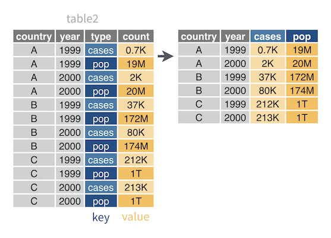
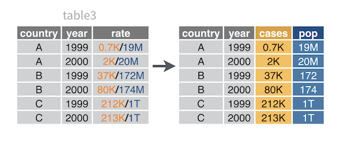
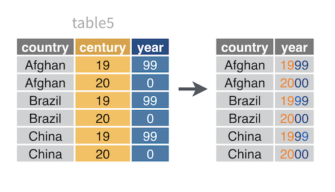

 Rodrigo Esteves de Lima Lopes \
*Campinas State University* \
[rll307@unicamp.br](mailto:rll307@unicamp.br)


# Tidyr

# Introduction

This tutorial is based on the following on-line sources:

- [Reshaping Data Using Tidyr](https://ademos.people.uic.edu/Chapter9.html)
- [Reshaping Your Data with tidy](https://uc-r.github.io/tidyr)
- [R for data science](https://r4ds.had.co.nz)
- [Sthda](http://www.sthda.com/english/wiki/tidyr-crucial-step-reshaping-data-with-r-for-easier-analyses)
- [UC Business Analytics R Programming Guide](https://uc-r.github.io/tidyr)
- [RStudio Education](https://rstudio-education.github.io)


My objective here is to manipulate data using some basics on `Tidyr` package. Please, refer to the cheatsheet  [cheatsheet](https://github.com/MiDiTeS/intro_to_R1/tree/master/CheatSheets) for further commands. 

`tidyr` makes possible to reorganise and tidy data  more easily and consistently. This is particular relevant if we think that language data tends to be specially messy. 

# Loading the packages

Usually `tidyr` is already part of our *R* distribution. If not, we will have to install it. 


```r
library(tidyr)
library(dplyr)
```

# '%>%' (pipe) operator

The pipe operator was first introduced in the package `magrittr`. It aims at helping us to write less code as we 'pass' the previous elements of a command to the next, saving us some more complex *R* syntax. For example this nested command:


```r
head(
  arrange(
   summarize(
       group_by(
           filter(mtcars, carb > 1),
           cyl
          ),
       Avg_mpg = mean(mpg)
      ),
   desc(Avg_mpg)
 ))
```

```
## `summarise()` ungrouping output (override with `.groups` argument)
```

```
## # A tibble: 3 x 2
##     cyl Avg_mpg
##   <dbl>   <dbl>
## 1     4    25.9
## 2     6    19.7
## 3     8    15.1
```

In a single line it would get much harder to read:

`head(arrange(summarize(group_by(filter(mtcars, carb > 1),cyl),Avg_mpg = mean(mpg)),desc(Avg_mpg)))`

If I choose not to nest commands, it might get a lot of coding:


```r
a <- filter(mtcars, carb > 1)
b <- group_by(a, cyl)
c <- summarise(b, Avg_mpg = mean(mpg))
```

```
## `summarise()` ungrouping output (override with `.groups` argument)
```

```r
d <- arrange(c, desc(Avg_mpg))
head(d)
```

```
## # A tibble: 3 x 2
##     cyl Avg_mpg
##   <dbl>   <dbl>
## 1     4    25.9
## 2     6    19.7
## 3     8    15.1
```

So, It would become much simpler:


```r
mtcars %>%
  filter(carb > 1) %>%
  group_by(cyl) %>%
  summarise(Avg_mpg = mean(mpg)) %>%
  arrange(desc(Avg_mpg))%>%
  head()
```

```
## `summarise()` ungrouping output (override with `.groups` argument)
```

```
## # A tibble: 3 x 2
##     cyl Avg_mpg
##   <dbl>   <dbl>
## 1     4    25.9
## 2     6    19.7
## 3     8    15.1
```

# Creating a data frame for use


```r
n<-10
wide <- data.frame(ID = c(1:n)%>% 
                     paste0("ID",.),
                   cr.1=runif(n, min = 1, max = 25),
                   cr.2=runif(n, min = 1, max = 25),
                   cr.3=runif(n, min = 1, max = 25))
head(wide)
```

```
##    ID      cr.1      cr.2      cr.3
## 1 ID1  6.279557 19.329807 14.443703
## 2 ID2  4.879252  4.308343 15.405532
## 3 ID3  1.269647 15.850346 18.504682
## 4 ID4 19.336894 22.380785 18.832518
## 5 ID5  6.725847  5.216771  5.200343
## 6 ID6  9.678956 15.397939 24.592491
```

# Some tidyr functions

In this tutorial we will focus on some of `tidyr` functions:

- `gather()` collapses columns un a key-paired set of values
- `spread()` reverses `gather()`, it makes multiples columns from 1
- `separate()` splits a single column into multiple columns
- `unite()` combines multiple columns into a single column

A visual representation of such actions would be:


## gather

`gather()` helps us to collapse columns into rows. It is common to use this command to gather similar elements within a single column. 


```r
long <- wide %>% 
  gather(Cr, Freq, cr.1:cr.3)
head(long)
```

```
##    ID   Cr      Freq
## 1 ID1 cr.1  6.279557
## 2 ID2 cr.1  4.879252
## 3 ID3 cr.1  1.269647
## 4 ID4 cr.1 19.336894
## 5 ID5 cr.1  6.725847
## 6 ID6 cr.1  9.678956
```

Some arguments of `gather()` that we might be using:

- `data`: Your data frame.
- `key`, `value`: The new names of the columns I will create in the output.
- `...`: The columns to gather. Use the exisiting variable names.
- `na.rm`: If `rm=TRUE`, it removes NA values

Naturally there are other arguments, but these are the ones we use quite frequently. [RStudio Education](https://rstudio-education.github.io/tidyverse-cookbook/tidy.html) offers a nice visual representation of `grather()`:


## spread

`spread()` reshapes a data frame into the wider format. If we take the same data frame we just created and apply this command, we will have our original data frame back:


```r
wide.2 <- long %>%
  spread(Cr, Freq)
wide.2
```

```
##      ID      cr.1      cr.2      cr.3
## 1   ID1  6.279557 19.329807 14.443703
## 2  ID10  5.312849  1.741625 18.447873
## 3   ID2  4.879252  4.308343 15.405532
## 4   ID3  1.269647 15.850346 18.504682
## 5   ID4 19.336894 22.380785 18.832518
## 6   ID5  6.725847  5.216771  5.200343
## 7   ID6  9.678956 15.397939 24.592491
## 8   ID7 20.310551  6.506565  5.596759
## 9   ID8 18.485113 15.317381 15.605162
## 10  ID9 18.456041 14.446905 13.068969
```


The main arguments of `spread()` are:

- `key`: The name of the column where the headings are.
- `value`: The values that will populate the rows.

A good visual representation of `spread()` would be:



## Separate

`Speparate()` breaks expressions in a same column using a character as basis. For example, in our dataset:


```r
head(long,10)
```

```
##      ID   Cr      Freq
## 1   ID1 cr.1  6.279557
## 2   ID2 cr.1  4.879252
## 3   ID3 cr.1  1.269647
## 4   ID4 cr.1 19.336894
## 5   ID5 cr.1  6.725847
## 6   ID6 cr.1  9.678956
## 7   ID7 cr.1 20.310551
## 8   ID8 cr.1 18.485113
## 9   ID9 cr.1 18.456041
## 10 ID10 cr.1  5.312849
```

**Cr** column brings data in the format *cr*+*.*+*number*. Separate would break *Cr* into to columns:


```r
long_separate <- long %>% 
  separate(Cr, c("Feature", "Number"))
head(long_separate,10)
```

```
##      ID Feature Number      Freq
## 1   ID1      cr      1  6.279557
## 2   ID2      cr      1  4.879252
## 3   ID3      cr      1  1.269647
## 4   ID4      cr      1 19.336894
## 5   ID5      cr      1  6.725847
## 6   ID6      cr      1  9.678956
## 7   ID7      cr      1 20.310551
## 8   ID8      cr      1 18.485113
## 9   ID9      cr      1 18.456041
## 10 ID10      cr      1  5.312849
```


The main arguments of separate are:

- `col`: column to be broken into others
- `into`: names for the new column
- `remove`: logical, if true deletes the input column

 A good visual representation of `separate()` would be:



## Unite

`unite()` does exactly the other way around: it unites some columns in a single one:


```r
long_unite <- long_separate %>%
  unite(Cr, Feature, Number, sep = "/")
head(long_unite,10)
```

```
##      ID   Cr      Freq
## 1   ID1 cr/1  6.279557
## 2   ID2 cr/1  4.879252
## 3   ID3 cr/1  1.269647
## 4   ID4 cr/1 19.336894
## 5   ID5 cr/1  6.725847
## 6   ID6 cr/1  9.678956
## 7   ID7 cr/1 20.310551
## 8   ID8 cr/1 18.485113
## 9   ID9 cr/1 18.456041
## 10 ID10 cr/1  5.312849
```

The only difference is that now I have chosen to use a "\" as a separator. The main arguments of unite are:

- `Data`: My data frame
- `col`: the name of the new column
- `...`: Columns to unite
- `sep`: Separator to use between values


 A good visual representation of `unite()` would be:



Please note that no separator was informed in the code above 


